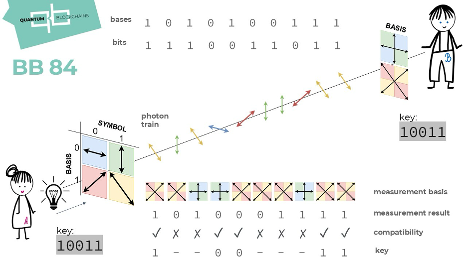
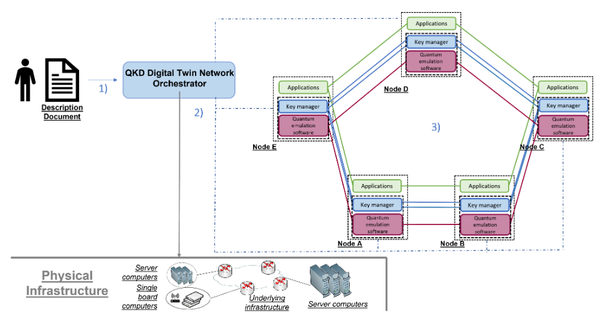
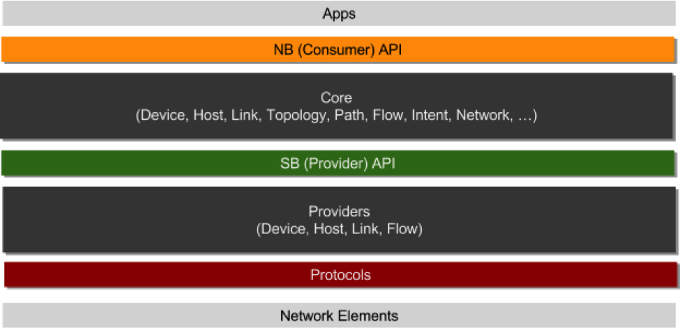
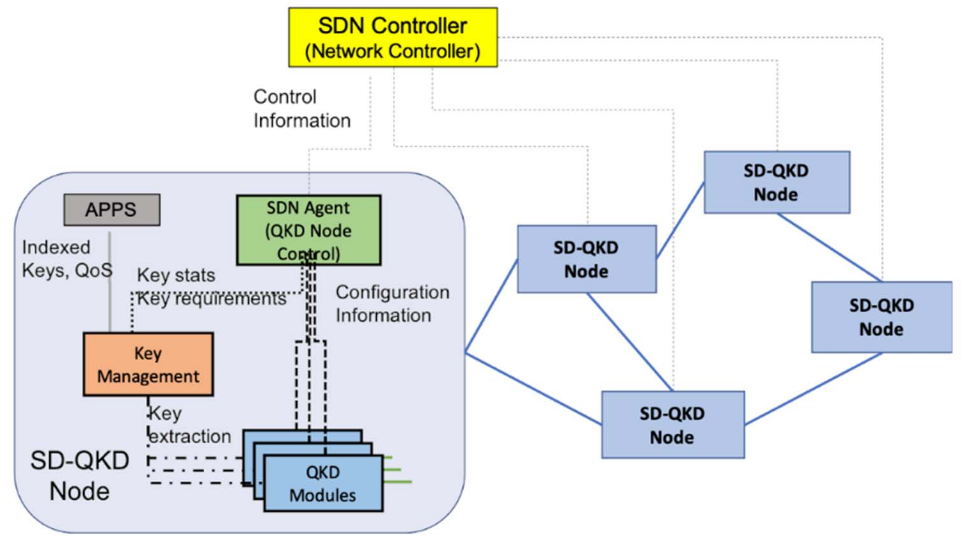
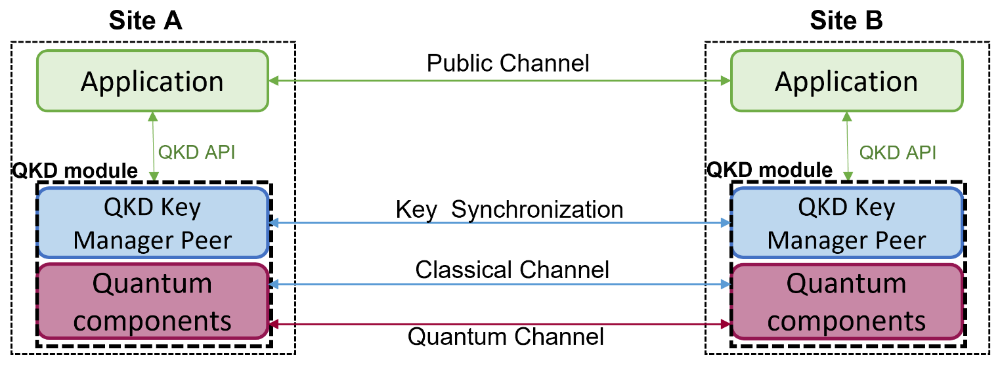
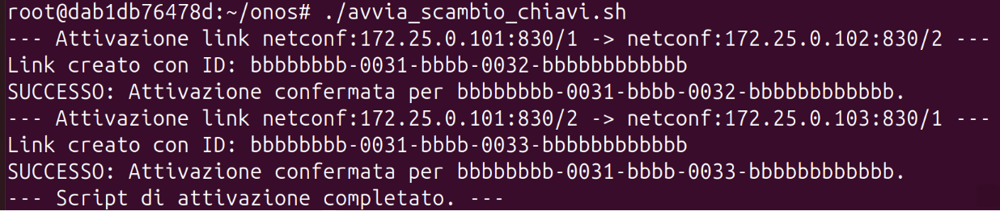
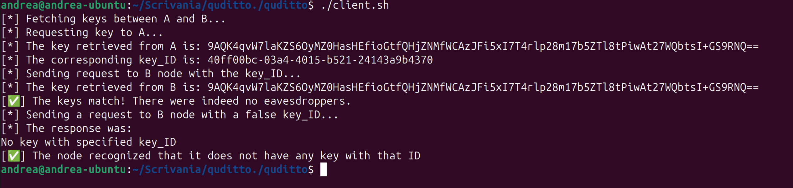

# SDN-enhanced Digital Twin per Reti QKD

<p align="center">
  
</p>

<p align="center">
  <strong>Università di Pisa — Dipartimento di Ingegneria dell'Informazione</strong><br/>
  Laurea in Ingegneria Informatica — A.A. 2024/2025
</p>

<p align="center">
  <strong>Tesi di Laurea</strong><br/>
  <em>Implementation of an SDN-enhanced digital twin for QKD networks</em>
</p>

<p align="center">
  <strong>Candidato:</strong> Andrea Doni &nbsp;|&nbsp;
  <strong>Relatori:</strong> Prof. Nicola Andriolli, Prof. Alessio Giorgetti
</p>

---

## Introduzione

Le reti di comunicazione moderne basano la loro sicurezza su algoritmi crittografici a chiave asimmetrica (come RSA) la cui robustezza dipende dalla difficoltà computazionale di problemi matematici. L'avvento del **calcolo quantistico** mette concretamente a rischio questi schemi: algoritmi come quello di Shor sono in grado di fattorizzare grandi numeri interi in tempo polinomiale, riducendo i tempi di decrittazione da secoli a secondi.

La **Quantum Key Distribution (QKD)** risponde a questa minaccia distribuendo chiavi crittografiche sfruttando le proprietà della meccanica quantistica: qualsiasi tentativo di intercettazione disturba irreparabilmente il canale quantistico, rendendolo rilevabile.

Il protocollo di riferimento usato in questo progetto è il **BB84**, proposto da Bennett e Brassard nel 1984:

<p align="center">
  
  <br/><em>Figura 1 — Funzionamento del protocollo BB84</em>
</p>

Per gestire reti QKD in modo flessibile e scalabile, si adotta il paradigma **Software Defined Networking (SDN)**, che separa il piano di controllo dal piano dati, consentendo l'orchestrazione centralizzata dei nodi quantistici tramite un controller.

---

## Architettura del Sistema

L'architettura complessiva integra un controller SDN (ONOS) con un Digital Twin della rete QKD, consentendo l'orchestrazione automatica della distribuzione delle chiavi senza intervento manuale.

<p align="center">
  
  <br/><em>Figura 2 — Architettura del Digital Twin SDN per reti QKD</em>
</p>

Il sistema è composto da tre componenti principali, ciascuno contenuto nella propria directory del repository:

---

## Componenti

### 1. ONOS — Controller SDN

La directory `ONOS/` contiene il **controller ONOS** (Open Network Operating System), containerizzato tramite Docker, con le estensioni sviluppate per la gestione di reti QKD.

ONOS è strutturato a livelli:

<p align="center">
  
  <br/><em>Figura 3 — Stack architetturale di ONOS</em>
</p>

Le principali estensioni sviluppate includono:
- **`quantum-app`** — applicazione ONOS che gestisce la topologia QKD e orchestra lo scambio di chiavi tra i nodi
- **Driver NETCONF** — driver per la comunicazione southbound con gli Agent tramite il protocollo NETCONF
- **Script di configurazione** (`init_network.sh`, `avvia_scambio_chiavi.sh`, `configure-qkd-nodes.sh`) — automazione della configurazione e attivazione dei link QKD

### 2. AGENT — Server NETCONF / ETSI GS 015

La directory `AGENT/` implementa il **server NETCONF** che espone le interfacce standard **ETSI GS 015 (SD-QKD)** per la gestione dei nodi QKD via SDN.

<p align="center">
  
  <br/><em>Figura 4 — Architettura di riferimento ETSI GS 015 SD-QKD</em>
</p>

L'Agent funge da interfaccia tra il controller ONOS e i nodi QKD emulati: riceve i comandi di configurazione dal controller e li traduce in operazioni sui moduli quantistici sottostanti.

Contenuto principale:
- `emulator-etsi-qkd/` — emulatore del nodo QKD conforme allo standard ETSI
- `network-scripts/` e `network/` — script e configurazioni di rete

### 3. Quditto — Digital Twin dei Nodi QKD

La directory `Quditto/` contiene il **Digital Twin** della rete QKD, realizzato tramite contenitori Docker. Emula una topologia a tre nodi (A, B, C) interconnessi su una rete bridge, simulando il comportamento fisico dei dispositivi QKD.

<p align="center">
  
  <br/><em>Figura 5 — Struttura di una rete QKD con nodi e canali quantistici</em>
</p>

Ogni nodo è un contenitore Docker che implementa lo stack QKD completo. La topologia è definita in `docker-compose.yaml` con i nodi A, B e C connessi sulla rete `qkd-net`.

---

## Prerequisiti

- [Docker](https://www.docker.com/) e Docker Compose
- [GitHub CLI](https://cli.github.com/) (per clonare il repo)
- Sistema testato su Ubuntu 24.04.2 LTS (macchina virtuale)

---

## Utilizzo

```bash
# 1. Clona il repository
git clone https://github.com/Andryd22/SDN-QKD.git
cd SDN-QKD

# 2. Avvia il Digital Twin (Quditto)
cd Quditto
docker-compose up -d

# 3. Avvia il controller ONOS
cd ../ONOS
docker build -t onos-quancom .
# Segui le istruzioni in ONOS/README.md per la configurazione della rete

# 4. Configura i nodi QKD e avvia lo scambio di chiavi
bash init_network.sh
bash avvia_scambio_chiavi.sh
```

---

## Risultati

Il test finale ha validato l'intera catena di controllo: una singola richiesta applicativa di alto livello ha attivato correttamente il flusso **ONOS → Agent SDN → Nodi QKD (Quditto)**, portando alla generazione automatica delle chiavi quantistiche senza alcun intervento manuale.

**Attivazione dello scambio di chiavi tramite ONOS:**

<p align="center">
  
  <br/><em>Figura 6 — Output dell'attivazione del link QKD tramite controller ONOS</em>
</p>

**Generazione e verifica delle chiavi su Quditto:**

<p align="center">
  
  <br/><em>Figura 7 — Output del client Quditto: chiavi generate, verificate e corrispondenti tra nodi A e B</em>
</p>

I risultati confermano che l'architettura SDN è in grado di astrarre la complessità hardware, permettendo l'orchestrazione di risorse di sicurezza quantistica tramite semplici chiamate software.
